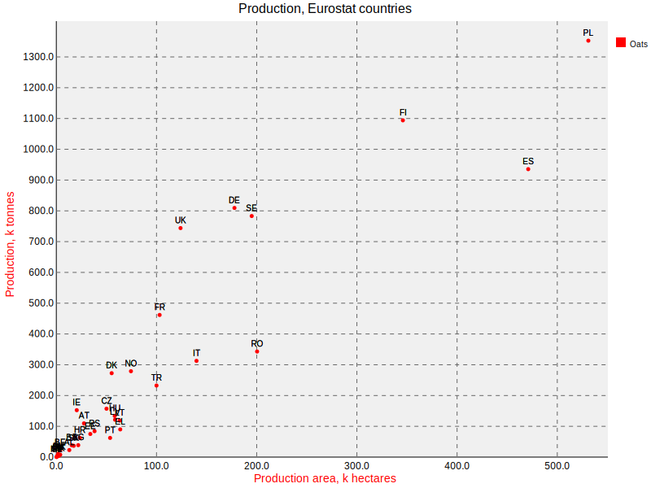
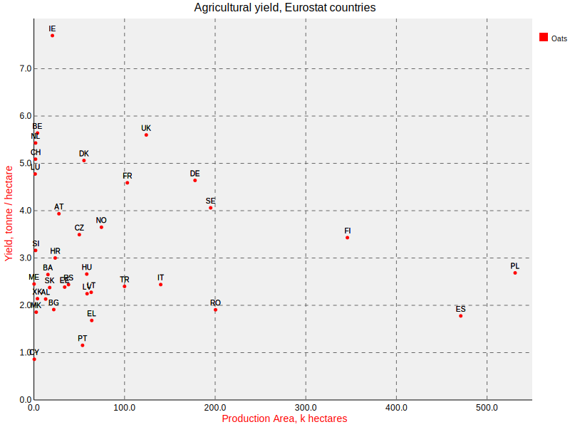

[brutal]: #title "Oats, Eurostat, and svg.charts"
[brutal]: #author "David Jones"
[brutal]: #date "2016-08-17"

[Eurostat](http://ec.europa.eu/eurostat/data/database) is great.

[svg.charts](https://pypi.python.org/pypi/svg.charts) is great.

Oats are great.
I have porridge most mornings for breakfast.

Using the data from Eurostat,
I made a little Python script that
uses svg.charts to make this SVG plot
of the Oat production of various countries:

(Go Poland!) Eurostat covers the EU countries
but also various related territories.
Countries like the potential applicant, Turkey, TR,
and the disputed territory of Kosovo, XK.

The broad picture is clear, the larger an area, the more oats.
But some countries clearly
use their land more productively than others.
Finland, FI, produces more oats than Spain, ES,
using about 25% less land.
Romania, RO, produces less than half the oats of
the United Kingdom, UK, but uses nearly twice as much land to do so!

Romania and Spain should put their shoulders to the plough
and use their land more productively!

Or should they?
If land is cheap and demand for oats relatively low,
maybe there is no incentive to use the land more efficiently.
Maybe increasing the production of each hectare is
more expensive overall.

The UK is pretty small, and land is generally quite expensive.
For the amount of land used, our oat production is pretty high.

The amount of crop produced for each hectare, is _yield_.
So how well can we do?
How much oats can you get from one hectare?

Eurostat provide yield data too:

Because the x-axis of this plot is the same as the first one,
each country's point just moves up or down between the two plots.

From this yield plot,
we can see that the UK does pretty well for yield.
One of the top few.
Ireland, IE, does really well.
Over 7 tonnes of oats per hectare.
Could the UK do better? Could the UK do as well as Ireland?

Maybe. But maybe not.
Ireland has a much smaller population than the UK,
so needs to produce less oats.
They have the luxury of being able to choose
the very best land to grow oats.

It's plausible that the more land you need to find to grow oats,
the less good that land is, so the yield goes down.

Even if it was theoretically possible to increase yield,
it might not be economically feasible.
It might require too much expensive labour,
or advanced mechanisation on difficult ground.

## My Porridge Recipe

Put 30 g porridge oats and 150 ml water together in a bowl.
Microwave on full power for 2 minutes (do not cover!).
Stir in 5 to 10 g of honey or jam.

I don't actually measure these quantities of course,
I do it by eye. But I did measure them for a week or so,
because I wanted to know how much I ate.

If it's too watery after 2 minutes in the microwave,
stick it in for a bit longer.
Generally 22 seconds.
