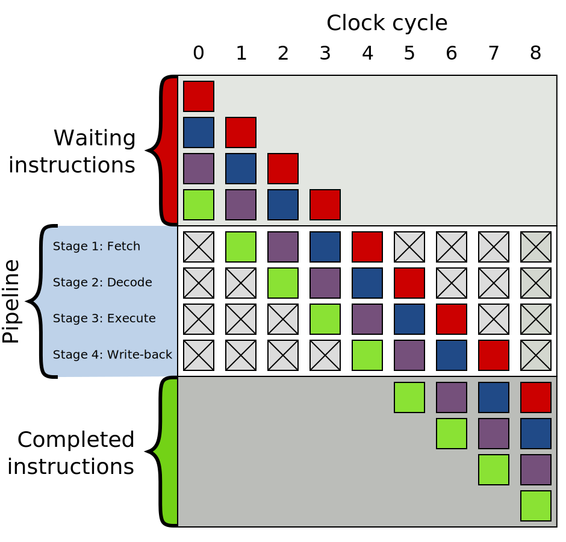

[brutal]: #title "Branching is bad (in machine code)"
[brutal]: #author "David Jones"
[brutal]: #date "2017-02-21"

A modern CPU executes machine instructions at great speed,
and part of this speed comes from _pipelined execution_.
This is where the procedure to execute an instruction is
broken down into many steps,
with the steps being joined together to make a pipeline.
Classically, these steps are _Fetch_, _Decode_, _Execute_,
_Write-back_, but these days pipelines are deeper and have more stages.
This improves speed because the sections of the pipeline can
execute concurrently.
Once the first instruction has been fetched
it proceeds to decode;
while it is being decoded, the next instruction is fetched.

The optimal case is when all stages of the pipeline
take the same time, and they are all occupied.
A 4-stage pipeline permits
4 instructions to be executed concurrently.
In principle this works well,
until it becomes unclear where the next instruction comes from.

A conditional branch instruction tests some processor state
(such as whether the carry flag is set, or whether a register is zero)
and then continues execution at either the next instruction,
or branches to a new instruction stream whose address is
specified by the branch instruction.

In pipelined execution, branch instructions are bad news.
That's because you don't know where the next instruction comes
from until after you've executed the branch.
In our classic 4-stage pipeline we should have fetched and
decoded it by then!
The typical solution to this is to attempt a _branch prediction_
and _speculatively execute_ the new stream.
Later, when the results of the branch are known,
the fate of the speculative instructions is known and they are
either discarded (if the prediction is wrong) or marked for
completion (if the prediction was right).

[The Wikipedia article on Branch Prediction](https://en.wikipedia.org/wiki/Branch_predictor)
provides a pretty good overview.

If the prediction is incorrect then we suffer a _misprediction penalty_.
The speculatively executed instructions are discarded and
the CPU has to wait while instructions are fetched from
the new instructions stream.

Each branch instruction comes with the burden of misprediction.
Better to reduce the branch instructions you use, right?

I am implementing a Forth system in 64-bit Intel assembly language.
It is a silly project,
but it keeps me happy and
implementing it gives me a few very geeky anecdotes.

# Implementing ABS

One of these anecdotes is eliminating branches
from the implemention of ABS.
`ABS` is a procedure that computes the _absolute value_ of a number.
In the version I am implementing,
the input is a signed 64-bit integer,
and the output is the positive integer with the same magnitude.

The first version I implement is [on github](https://github.com/drj11/sixtyforth/commit/296d92e47b2a01af68b50cb43170f11d060ca3de).

When you remove the Forth procedure entry and exit code,
it's basically:

            mov rax, [rbp-8]    ; NASM syntax, destination on left
            test rax, rax
            jns .pos
            neg rax
    pos:    mov [rbp-8], rax

Having executed `test rax, rax`, the `jns` instruction
Jumps if Not Signed.
In this case Signed means "has the sign bit set" which means
negative;
So if `rax` is 0 or positive the jump is taken and
so the `neg rax` instruction is skipped.
`neg rax` negates `rax`.

This is roughly equivalent to the pseudo code:

    if rax < 0:
        rax = -rax

And this does implement ABS.

But it contains a conditional branch.

# Branchless

In a whimsical moment I decided to "improve" the code by making
it branchless.

The new version is [also on github](https://github.com/drj11/sixtyforth/commit/756eadd27c18800e1697ea86953ca7694880024d).

The code is:

    ; Convert carry flag to Forth boolean in rcx
    mov rcx, rax
    shl rcx, 1
    sbb rcx, rcx
    ; rcx is now 0 or -1
    ; If rcx is -1, negate the old-school way.
    xor rax, rcx
    sub rax, rcx
    mov [rbp-8], rax

Observations: more code; more comments are required;
the comments are (slightly) misleading.

In the first comment,
"Forth boolean" means a value that is either 0 or -1.
And while it is true that the carry flag is converted,
first the sign flag is shifted into the carry flag.

The new implementation is in two parts:
1. compute a value, in `rcx`, that is either 0 or -1; then,
2. cunningly use this to either negate `rax` or leave it unchanged.

The first part also involves a bit of cunning:

The "Subtract with Borrow" instruction computes
`(Rd - Rs) - B`
where `Rd` is the destination register,
`Rs` is a source register, and
`B` is the borrow (aka carry) flag which is either 0 or 1.

In `sbb rcx, rcx` the source and destination are the same:
the value computed is `(Rd - Rd) - B`,
which is the same as `- B`.
so the result is 0 when the carry flag is 0,
and -1 when the carry flag is 1.

This is a neat trick to turn a carry flag into 0 or -1.
Wish I had thought of it, but I didn't.
I found it somewhere on the internet,
and now I can't find out where.
[update: it was probably from [this blog
article](http://www.retroprogramming.com/2012/06/itsy-forth-compiler.html?m=1)]

# 2's complement

The second part relies on 2's complement notation.
-1 is 0b1111...1111 (64 bits, all set to 1).
0b1111...1111 - S is the same as
0b1111...1111 XOR S (because there are no borrows).
We want to compute 0 - S.
Well, -1 - S is nearly right. Just add 1 to the answer:

0 - S == (1 - 1) - S == 1 + (-1 - S)

And adding 1 is the same as subtracting -1.

How does this all help?
We want to compute:

0 - S

which is the same as

1 + (-1 - S)

same as

(-1 - S) - (-1)

same as

(S XOR -1) - (-1)

same as

(S XOR RCX) - RCX

when RCX is -1.

So, when RCX is -1 we can negate S by
computing `(S XOR RCX) - RCX`.

When RCX is 0 note that `(S XOR 0) - 0` is S.
So S is unchanged.

Perfect, that's exactly what we want.

# This is an Improvement?

Well, there's a reason I used scare quotes around "improve",
above.

There are fewer branches. That's good.

There is more code. That's bad.

More registers are used. That's bad too.

Ideally I would benchmark, but I haven't.
`ABS` is such a small part of even an unrealistic benchmark.
There are so many other branches,
that removing one is going to make a tiny difference.

So no benchmark.
But I am warmed by the satisfaction that
there is one fewer branch in the code. :)
