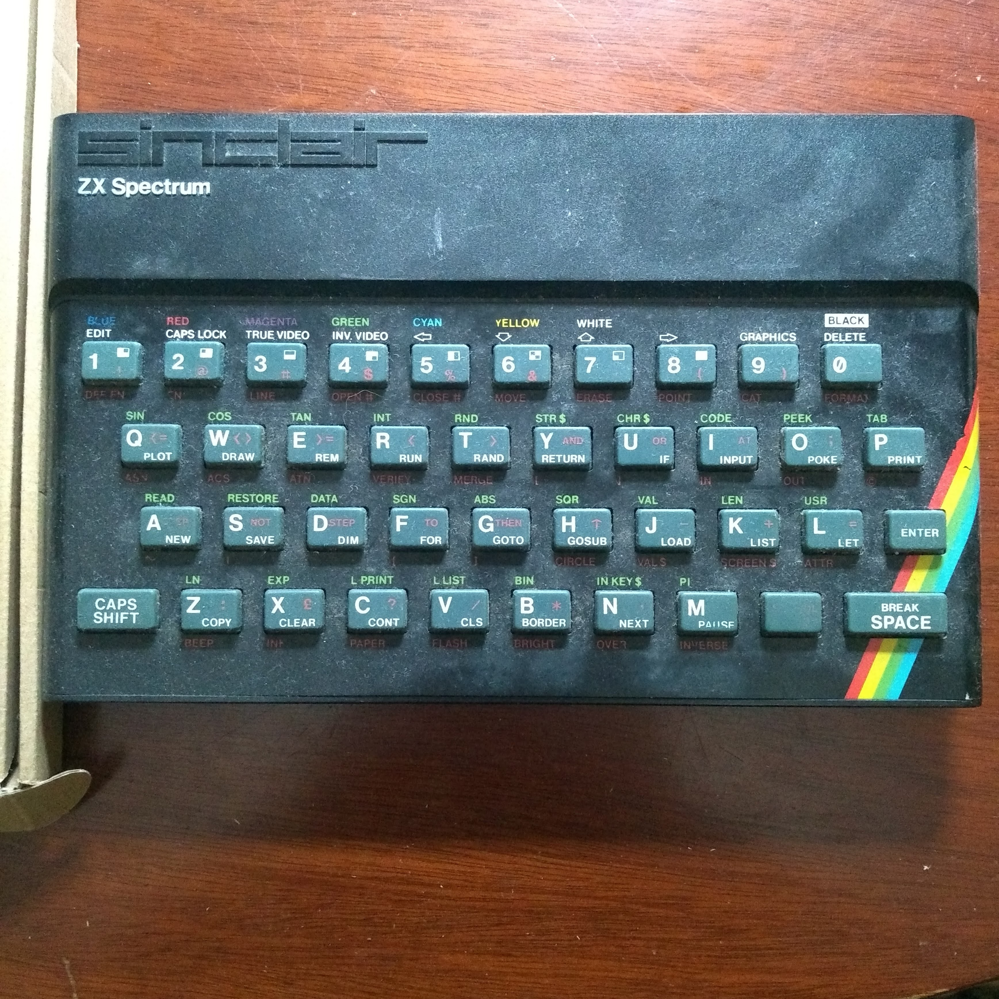
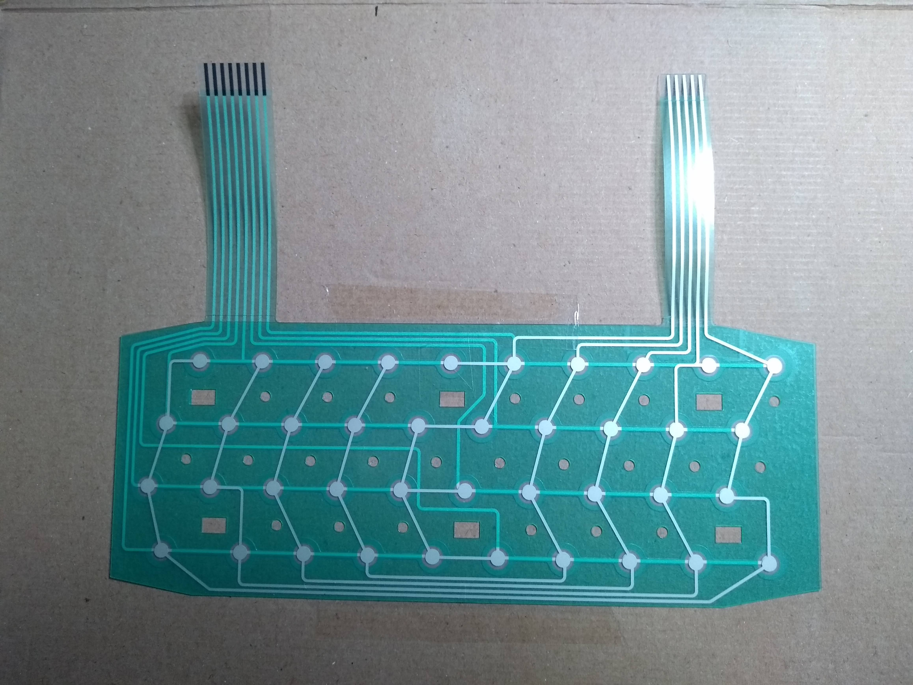
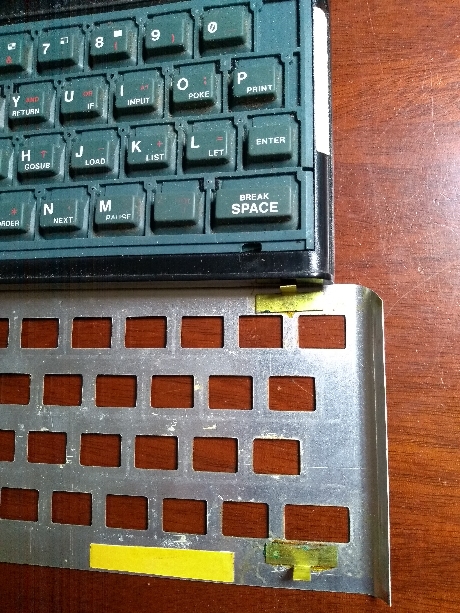
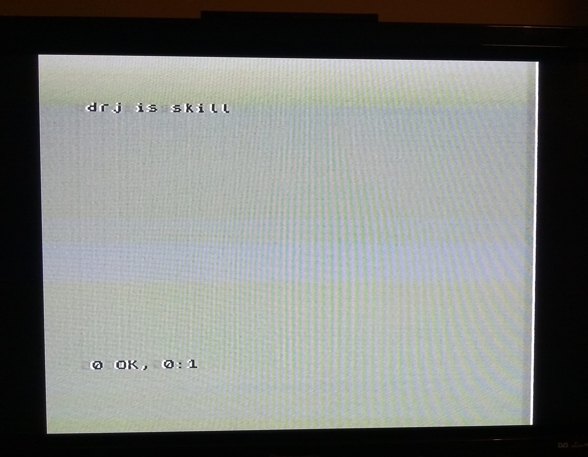

[brutal]: #title "ZX Spectrum hardware repair"
[brutal]: #author "David Jones"
[brutal]: #date "2022-01-07"

_The Sinclair ZX Spectrum_

Last year a friend of mine found their childhood ZX Spectrum
in a cupboard at their mum's.
Knowing my interest in ancient computers and that the
ZX Spectrum was my childhood computer,
they very kindly gave me theirs.

It even came with a power supply, but no tape leads, and no TV lead.
The power supply didn't work,
the cable was broken near where it enters the power supply case.
A common problem and one that i had probably fixed as a
teenager.
My first chance to use the soldering station that i got from
Aldi ages ago have had lying around in the cupboard since then.
Nothing fancy, i cut the cable around the fray, stripped a short
section back, and twisted and soldered them back together.
Insulated with a bit of tape.
I had to destroy the grommet to get at the frayed cable, so i
bodged that with a bit of hot-glue to cover the hole and keep
the cable in place.

Couldn't find the TV cable in the gigantic box of cables i had,
but then i remembered the Commodore 64 that someone else had
given me. Same cable. yay!

Plugged it into the telly, somehow worked out how to tune the
telly in and switched on the Speccy.
It worked!

But, no clicky no keyboard. None of the dead-flesh rubber keys
seemed to do anything.
Probably a broken keyboard membrane.
My childhood Speccy had the same problem and i “fixed” it then
by buying a remaindered Acorn Atom keyboard (with case, but no
electronics) and hand-wiring the keys into the ZX Spectrum
keyboard matrix and hard-soldering it into the caseless Speccy.

<figure>

<figcaption>
Replacement Keyboard Membrane
</figcaption>
</figure>

Fast forward 30-odd years and you can buy pattern replacement
membranes off the internet for a few quid.
Better than the original because they are slightly stronger.
I also ordered an inline power switch.
One the reasons the Speccy power cable failed so often was that
there was no power switch.
So when a game crashed, or the Speccy
glitched, or the loader failed, or you simply wanted to play
another game, you had to pull the plug and put it back in to reset.
The inline switch lets me switch it off and on without all that
cable strain.

Of course after it arrived i left all that lying around until
i had a moment between projects at the end of the year.
Thanks to the internet, replacing the keyboard proved
relatively straightforward (pulling the connector out is still
fiddly and puts a nightmare amount of strain on the soldered part).
Nice tip to put insulation on the ULA's metal case, because i
really don't see how i could bend the flex connector without it
touching there.

I put it all back together and tested it without the telly.
Nice clicking sound when i pressed a key
(the clicking sound comes from the beeper, not the key switch),
so i could be pretty confident the keyboard worked even though i
couldn't see anything.

<figure>

<figcaption>
Carpet Tape (double sided) in yellow; holds the metal keyboard cover down
</figcaption>
</figure>

Carting everything back upstairs to the telly room, and...

success!

<figure>

<figcaption>
drj is skill
</figcaption>
</figure>

Now, how to load games? (the subject of my next adventure, not
yet written)

# END
