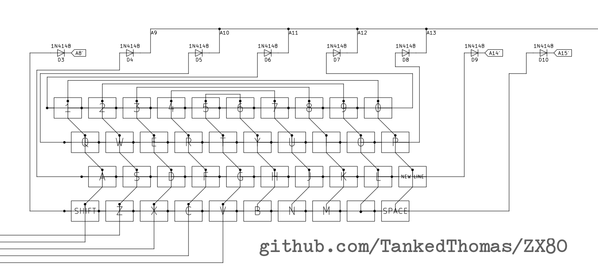

[brutal]: #date "2026-02-10"
[brutal]: #author "drj"
[brutal]: #title "ZX81 KEYBOARD Subroutine—Commentary"

[Chapter Ten of "Mastering Machine Code On Your
ZX81"](https://archive.org/details/masteringmachinecodeonyourzx81/page/87/mode/2up) [BAKER1981],
has a description of the new ROM (ZX81) keyboard scanning routine.
In the new ROM it is at 0x02BB and is called [`KEYBOARD` in
[LH1982]](https://archive.org/details/complete-timex-ts1000-sinclair-zx81-rom-disassembly/page/n7/mode/2up).

`KEYBOARD` is a neat little routine that
deposits in HL information about which keys are pressed, and
additionally if Shift is pressed; Shift can be pressed
in combination with another key.

The keyboard is divided into 8 horizontal zones (sections in [BAKER1981])
of 5 keys each (except zone 0 which only has 4 keys);
each zone corresponding to a bit in L.
The keyboard is also divided into 5 vertical zones (sections) of 8 keys each
again except Zone 1 which has only 7),
and a bonus "vertical" zone (Zone 0),  that has only the Shift key (bottom left);
each zone corresponding to a bit in H.

After calling the routine the bits of H and L are all set, except for
where the corresponding zone has keypress.
When there is no keypress, all the bits are set.
If a single key is pressed, we can cross-reference the horizontal
zones with the vertical zones and work out which key is pressed.

The horizontal zones are arranged so that an adjacent block of 5 keys
is one zone (QWERT is zone 2 for example);
The vertical zones are arranged so that 2 coloumns of 4 keys each
is one zone.
Conveniently the number keys 1 2 3 4 5 are in vertical zones 1 to 5;
the vertical zones are _mirrored_ on the right-hand side of the keyboard.

The zones look like this:

       +--V1---------------+
       |                   |
       |   +-V3--------+   |
       |   |           |   |
       |   |   +V5-+   |   |
       |   |   |   |   |   |
    H3 1 2 3 4 5   6 7 8 9 0    H4
    H2 Q W E R T   Y U I O P    H5
    H1 A S D F G   H J K L [NL] H6
    H0   Z X C V   B N M . [SP] H7
         |   |       |   |  
         |   +-V4----+   |  
         |               |  
         +--V2-----------+  

Thus when S is pressed H is 0xFB (vertical zone 2 is clear), and
L is 0xFD (horizontal zone 1 is clear).
You can check the codes with a simple BASIC program i've added at
the end of this article.

The hardware for the ZX81 keyboard is very simple and is a more regular
version of the above scheme: the keys are arranged logically in a 8x5 matrix,
the shift key is not special in hardware, it is part of the `Shift Z X C V`
zone. Reading a keyboard port returns 5 bits corresponding to the keys
pressed in one of the 8 zones according to which port was read (sort of).

Thanks to [this github repo where someone is reconstructing the ZX80
PCB](https://github.com/TankedThomas/ZX80) i can show this detail from the
schematic (the ZX81 and the ZX Spectrum have the same keyboard schematic):

</img>

The Z80 address bus A8 through to A15 are wired to the 8 horizontal
zones, and five wires come off the bottom which are are fed into the Z80
D0 to D4 lines through a 74LS135 driver which is selected when the
keyboard I/O port is read.
When a key is pressed in a zone that has its A- wire low, the corresponding
D wire will be driven low and sensed by the Z80 `IN` instruction (as a 0 bit).

The routine for scanning the keyboard is given on [BAKER1981] page 95 (here,
numbers are in hexadecimal, but in my text i shall try and use a 0x prefix):

    K00: LD HL,FFFF
    K03: LD BC,FEFE
    K06: IN A,(C)
    K08: OR 01
    K0A: OR E0  ; loop target
    K0C: LD D,A
    K0D: CPL
    K0E: CP 01
    K10: SBC A,A
    K11: OR B
    K12: AND L
    K13: LD L,A
    K14: LD A,H
    K15: AND D
    K16: LD H,A
    K17: RLC B
    K19: IN A,(C)
    K1B: JR C,K0A
    K1D: RRA
    K1E: RL H
    K20: RET

If you are not that familiar with Z80 assembler or you need a refresher,
i've put an emergency cheatsheet at the end, but be warned it is
not a tutorial—probably best if you know some sort of assembler already.

- `IN A,(C)` puts BC on the entire 16-bit address bus (for an I/O cycle),
  C = 0xFE is used for the keyboard, but in fact any port with the bottom
  bit reset will do (the I/O decoder only uses A0). The upper 8 bits of the
  port address (B) are used to drive 8 lines in the keyboard matrix (one for
  each Horizontal Zone). In ordinary operation, only 1 bit in B should be reset.
- The JR at address 0x18 is a loop and the only reason the routine terminates;
- the loop is exited when C flag is clear; C flag is set (or reset) by the
  earlier `RLC B` instruction at 0x17;
- the `RLC B` is the only instruction in the loop that affects B, which is
  assigned 0xFE before the loop (at 0x03);
- Therefore there are 8 iterations of the loop, exiting when the `RLC B`
  changes B from 0x7F (bit 7 reset) to 0xFE (bit 0 reset) which is the
  only time that the C flag is reset;
- The entire routine is a loop of 8 iterations, with a bit of book-keeping
  before and after.

- HL has all bits set with `LD HL, 0xFFFF` at 0x00;
- Within the loop both L and H are only changed by ANDing with
  other values (at 0x13 and preceding for L, and 0x16 and preceduing for H),
  this they start with all bits set, and have some of them reset.

- `SBC A,A` at 0x10 is a fun trick: A becomes either all bits set,
  when carry is set, or all bits reset, when carry is reset. The C flag
  is effectively copied into all the bits of A. I will read around this,
  before and after, to see how L is changed.
- The `SBC A,A` is preceded by `CP 0x01` so the C flag is set only when
  A is 0;
- `CPL` at 0x0D means that A is 0 for the following `CP` instruction
  (sets C flag) only when when it is 0xFF prior to
  this `CPL` instruction (after some ORing).
  In other words when no keys are pressed (in that zone);
- the effect of the three instruction `CPL` ; `CP 0x01` ; `SBC A, A` is to
  set A to either 0xFF or 0x00 according to whether it starts as
  0xFF or not. It is a quite compact way of encoding something like
  `A = (A == 0xFF) ? 0xFF : 0x00;` in C.
- After the `SBC` are the three instructions `OR B` ; `AND L` ; `LD L,A`
  (the only time L changes after its initialisation);
- When A is 0xFF, `OR B` has no effect (all bits already set), `AND L`
  makes A a copy of L, and then L becomes a copy of A: so no change to L; but,
  when A is 0x00, `OR B` assigns B to A (B has a single reset bit), `AND L` ; `LD L,A`
  clears a single bit in L and puts the result back into L.
- Thus for each iteration of the loop, a bit in L is cleared if and only if
  a key is pressed in the corresponding Horizontal Zone.

- H is a lot simpler, `LD A,H` ; `AND D` ; `LD H, A` (effectively `AND H, D` if
  that were a legal instruction) reset in H those bits in
  D that are reset; and D is a copy of A, preserved from `LD D, A` at 0x0C.
- There are some fun entry and exit tweaks. On entry to the loop at 0x0A
  the port has already been read with `IN A,(C)` ; `OR 0x01`;
  this reads the port (Horizontal Zone 0) and sets bit 0 of A.
  Thus in Horizontal Zone 0 only, bit 0 is always set,
  meaning the keypress of that key is ignored: It's the Shift key.
- On loop exit the port has been read but not really processed yet. `IN A,(C)` is
  a port read for Horizontal Zone 0 again (recall that B is 0xFE when the loop
  exits). The following `RRA` `RL H` use the C flag to shift bit 0 out of A
  (rightwards) and into H (leftwards); thus the Vertical Zones recorded in
  H are shifted left 1, and bit 0 of H is bit 0 from the
  (true) Horizontal Zone 0 of the keyboard matrix: the shift key.
- The `OR 0xE0` at the beginning of the loop means that the leftmost
  3 bits of the port data are ignored (set); they aren't used for the
  keyboard, but bit 6 is used for US/UK detection in the ROM and
  determines how many MARGIN lines are output for the video display.

The keypress information returned by this `KEYBOARD` routine is a bit _raw_,
[BAKER1981] has a further routine that converts this raw keypress information
into character codes.

The ZX81 keyboard seems a little bit primitive (it is), but more or less
elaborate versions of this exist in most keyboards.
Even things that you might not think of as keyboads, like the
[Game Boy action and direction buttons which are arranged in a 2×4
matrix](https://gbdev.io/pandocs/Joypad_Input.html).

### Emergency Cheatsheet for Z80 assembler

- `LD` _Dest,Source_ — LOADs (that is, _moves_) a thing from Source to Destination,
  Although Z80 is an 8-bit processor, some 16-bit loads are possible.
  Note: Destination on left (generally true for most of the Z80 instructions).
- `IN A,(C)` — read from I/O port C (BC really) and put result in A.
- `OR` _Thing_ — modify register A by ORing Thing into it, a lot of instructions
  implicitly use register A. `AND` works similarly.
- `CPL` — Complement A.
- `CP` _Thing_ — Compare, subtract Thing from A without changing A but set
  flags accordingly (in this code, C flag for Carry is used).
- `SBC A,` _Thing_ (also written `SBC Thing`); Subtract with Carry (from A);
  when performing a subtraction, the Carry flag is actually a Borrow flag.
- `AND` _Thing_ — mofidy register A by ANDing Thing into it.
- `RLC` _Reg_ — Rotate Left Circular, the bits of the 8-bit register are
  rotated to the left, with bit 0 taking on the previous bit 7.
- `JR` _Cond,Target_ — Jump Relative (that is, short) to Target if Condition
  is met (in this case C means if C flag is set).
- `RRA` — Rotate Right A, the bits of A are rotated, including the C flag:
  C flag becomes the previous bit 0, bit 7 becomes the previous C flag.
- `RL` _Reg_ — Rotate Left, a rotate in which C flag participates:
  C flag becomes the previous bit 7, bit 0 becomes the previous C flag.
- `RET` — Return (from subroutine).

### A BASIC program to inspect the values

The SLOW display ROM routines call KEYBOARD every frame (50 times a second
on a UK model) and deposit the HL result in system variable `LAST_K` (the
address of which is listed in [VICKERS1981] Chapter 28).
So it is not necessary to call the subroutine directly.

A simple BASIC program can display the scancodes, in decimal.
L (for horizontal zone) is displayed on the left,
H (for vertical zone and Shift) on the right.

    10 PRINT AT 21,0;PEEK 16421,PEEK 16422
    20 SCROLL
    30 GOTO 10

(press SPACE/BREAK to break into the running program and stop it)

## REFERENCES

[BAKER1981] "Mastering Machine Code On Your ZX81"; Toni Baker; 1981.

[LH1982] "The Complete Timex TS1000 & Sinclair ZX81 ROM Disassembly";
  Dr. Ian Logan, Dr. Frank O‘Hara.

[VICKERS1981] "ZX81 BASIC Programming"; Steven Vickers; Second Edition 1981.

# END
